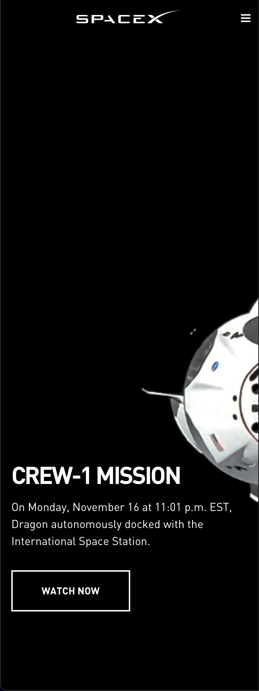
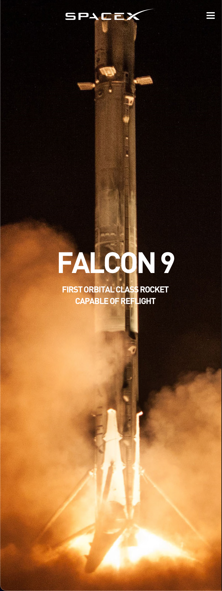
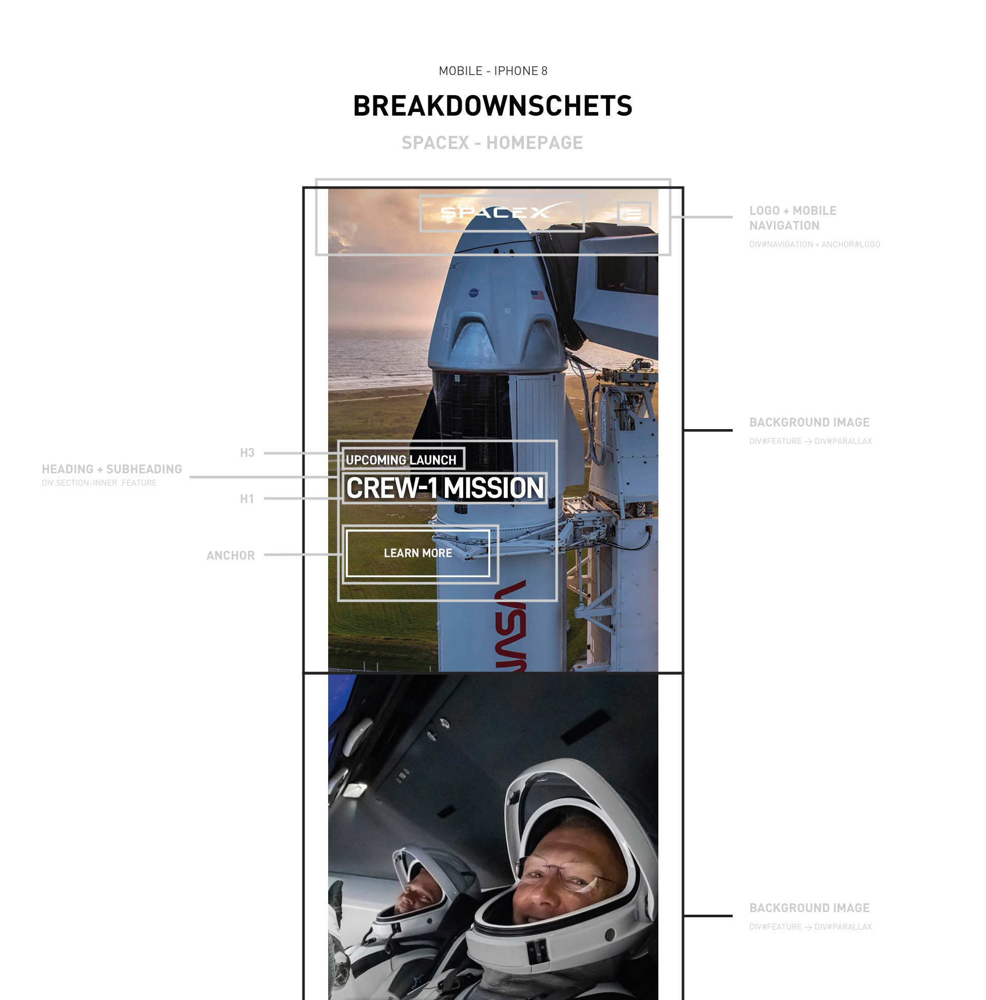
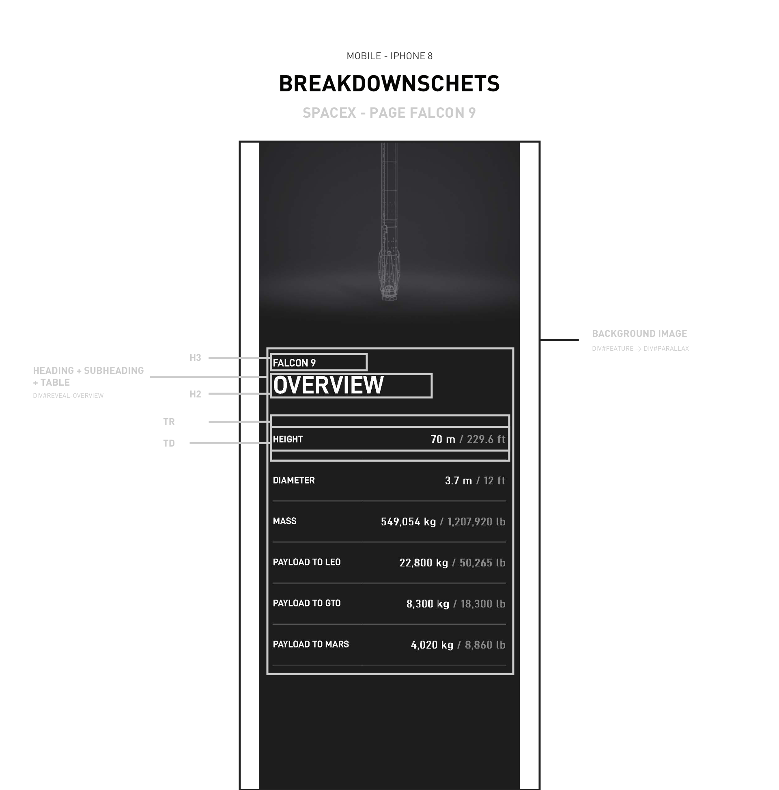
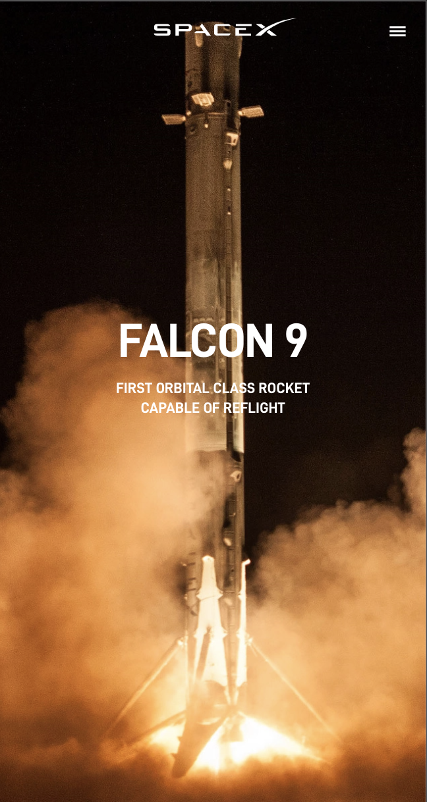
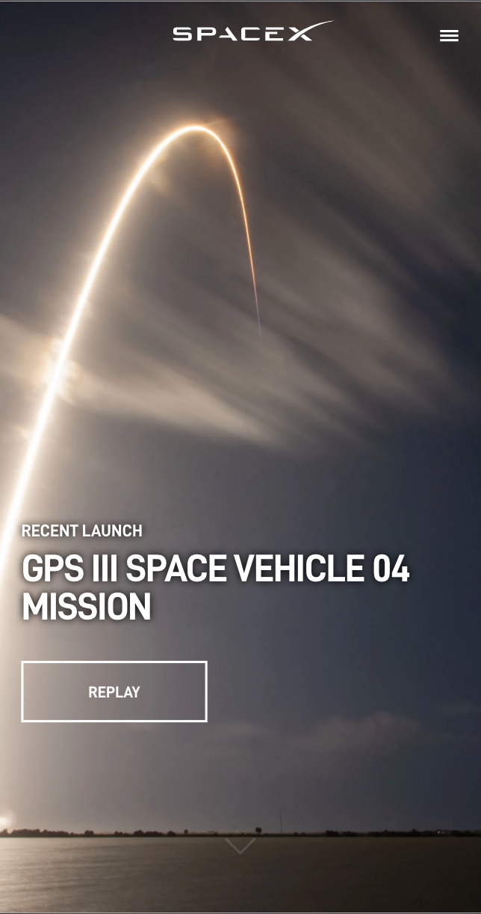

# Procesverslag

**Auteur:** -Daan Ketelaars-

## Bronnenlijst

1. -bron 1-
2. -bron 2-
3. -...-

## Eindgesprek (week 7/8)

-dit ging goed & dit was lastig-

**Screenshot(s):**

-screenshot(s) van je eindresultaat-

## Voortgang 3 (week 6)

-same as voortgang 1-

## Voortgang 2 (week 5)

-same as voortgang 1-

## Voortgang 1 (week 3)

### Stand van zaken

Code zo netjes mogelijk en gestructureerd houden was wel klein dingentje, heb mij hier wel op gefocust want mijn code kan af en toe nog wel wat chaotisch zijn.

Voor de rest ging alles prima en heb ik niet veel problemen gehad qua code. Wat dingen opgezocht bij Dev.to, stackoverflow en MDN om even te zien hoe ik sommige dingen het beste kan aanpakken. Hierna geprobeerd niet de code te kopiëren maar zoveel mogelijk uit mij zelf te schrijven en op mijn eigen manier.

**Screenshot(s):**

Home is af, al begin gemaakt aan de 2de pagina

### Agenda voor meeting

-samen met je groepje opstellen-

| student 1      | student 2          | student 3    | student 4        |
| -------------- | ------------------ | ------------ | ---------------- |
| dit bespreken  | en dit             | en ik dit    | en dan ik dat    |
| an dat ook nog | dit als er tijd is | nog een punt | dit wil ik zeker |
| ...            | ...                | ...          | ...              |

### Verslag van meeting

-na afloop snel uitkomsten vastleggen-

## Breakdownschets (week 1)

**Breakdownschets 01**

**Breakdownschets 02**

**Je startniveau:** -Zwart-

**Je focus:** -responsive & surface laag-

**Je opdracht:** -Wikipedia: https://www.spacex.com & https://www.spacex.com/vehicles/falcon-9/

**Extra uitleg:** -Meer gaan focussen op Web animaties en vanilla JS-

**Screenshot(s) van de eerste pagina (small screen):**

**Screenshot(s) van de tweede pagina (small screen):**

